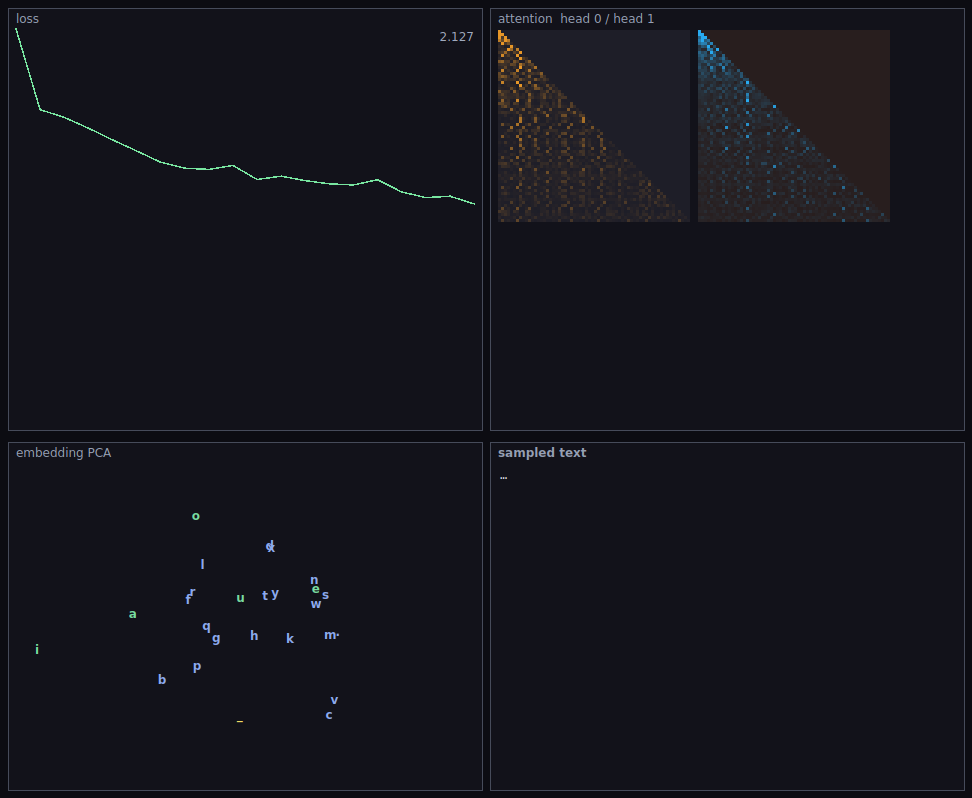

# HandmadeGPT

A character-level GPT trained live in front of you — forward pass, backward
pass and Adam all written by hand in C++. No ML frameworks, no autograd, no
BLAS. Watch the loss fall, the attention heads specialize, the character
embeddings organize themselves, and the sampled text go from noise to words.



## Model

One pre-LN transformer block, ~57k parameters:

- character embeddings + learned positional embeddings
- 2-head causal self-attention (d = 64, head dim 32, context 64)
- GELU MLP (hidden 256), residual connections, three layer norms
- untied unembedding, cross-entropy over all positions

The backward pass is exact: softmax-attention backprop through the causal
mask, layer-norm gradients, GELU derivative (tanh approximation), the lot.
Training parallelizes over the batch with per-thread gradient buffers reduced
before the Adam step.

## Visualization

Four live panels: the loss curve; both attention maps (context × context,
lower-triangular — early in training they are diffuse, then structure
appears); a PCA of the character embedding matrix (top-2 components by power
iteration — vowels, consonants and the space character drift into their own
regions); and text sampled from the model every ~80 steps.

Ships with a small built-in corpus (original text, deliberately plain and
repetitive so a char model learns fast) and a "Load text file"
button to train on anything else.

## Verified

`TRANS_TEST=N` runs N optimizer steps headlessly and prints the loss
trajectory: from ln(26) ≈ 3.26 at init to < 0.9 within 250 steps at batch 8 on
the built-in corpus, with word-like fragments in the samples.

## Build

```
cmake -B build -DCMAKE_BUILD_TYPE=Release
cmake --build build -j
```

Requires Qt6. C++17, Qt6 Widgets only. `DUMP_FRAMES=N` saves a screenshot of
the visualization headlessly.
